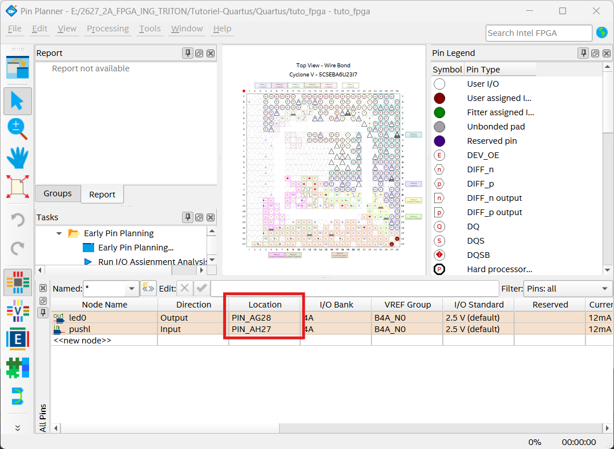
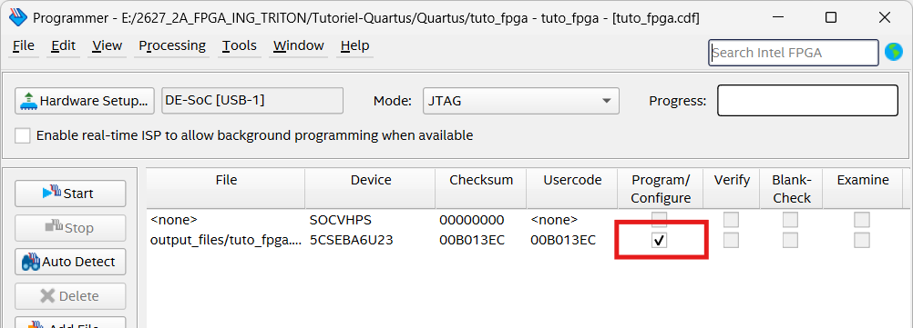
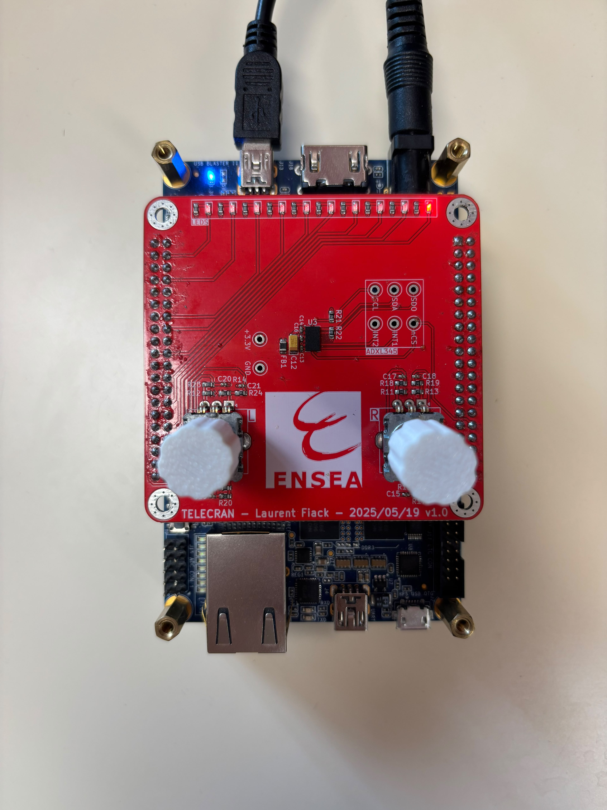
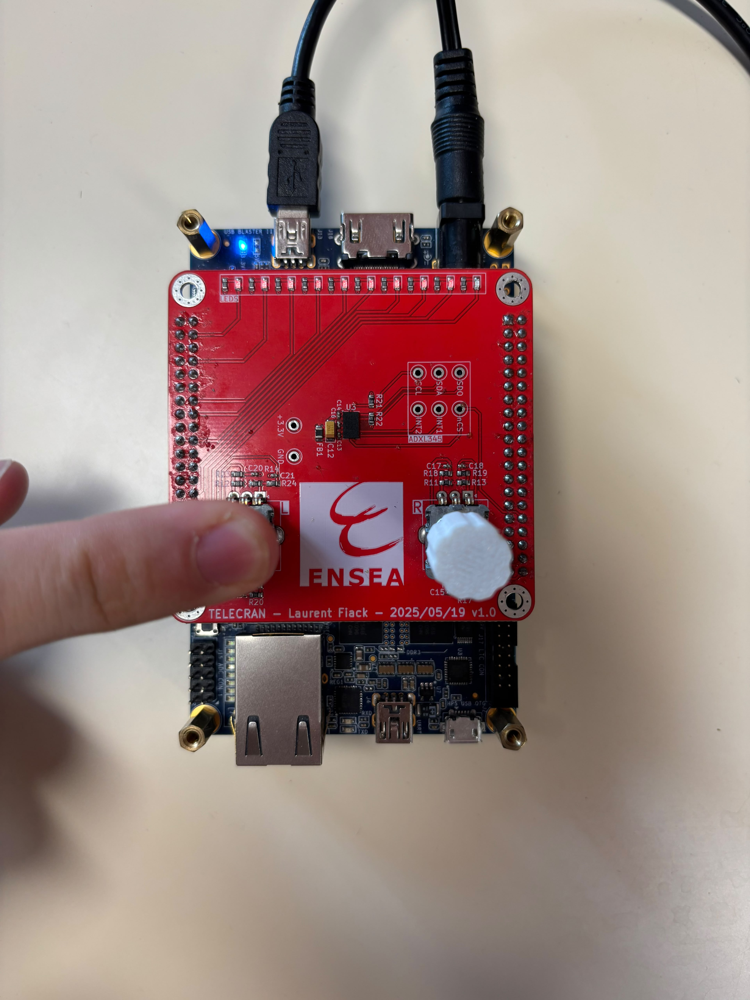
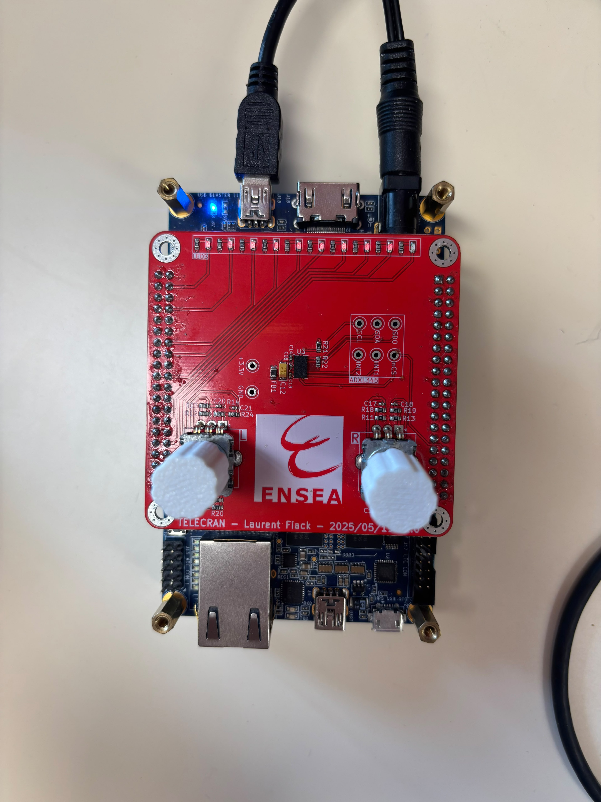
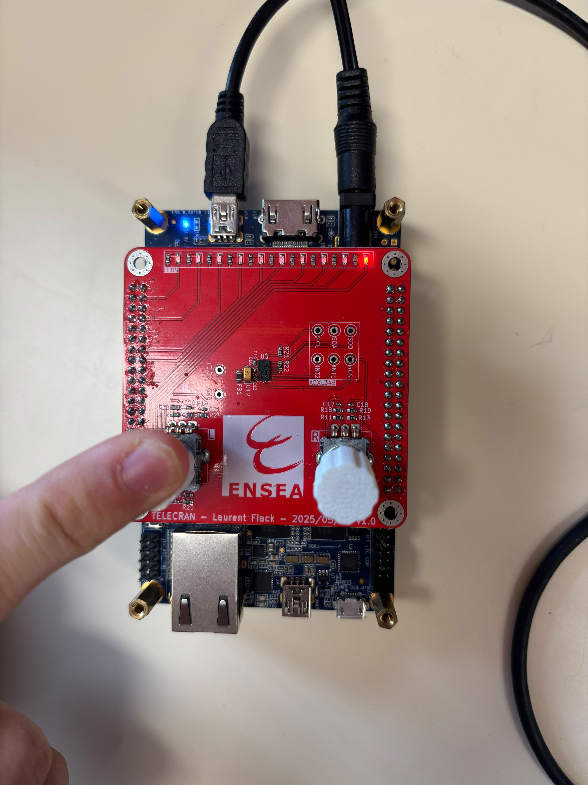
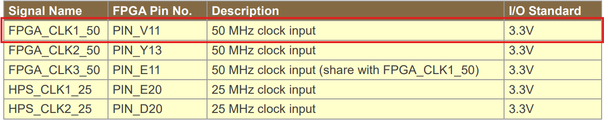
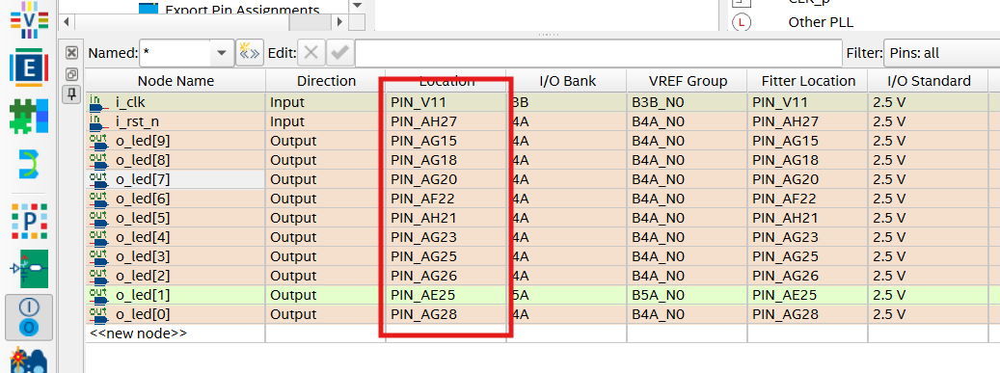
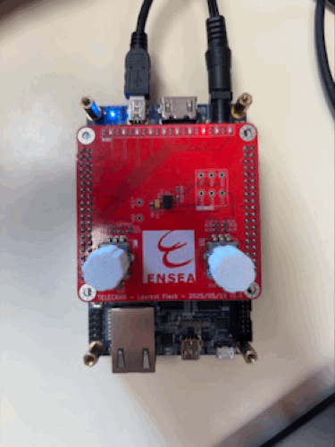

# TP1 : Tutoriel Quartus
Le TP1 a pour objectif de se familiariser avec Quartus et le langage VHDL en concevant, compilant et programmant des circuits simples sur une carte FPGA.

En TD, nous avons utilisé le logiciel Modelsim pour simuler vos composants VHDL. Pour les tester sur FPGA, nous aurons besoin du logiciel Quartus Prime Lite.

## Branchement de la carte
Pour fonctionner, la carte doit être alimentée. Le courant fourni par le port USB n'est pas suffisant, il faut ajouter une alimentation extérieure.

La carte est programmée par le port USB nommé `USB BLASTER II`. Il se situe du même côté que le connecteur d'alimentation et que le port HDMI. La carte ne peut pas être programmée par les autres ports USB.


## Création d'un projet
Sur Quartus, nous créeons un projet du nom de `tuto_fpga` en veillant bien à choisir comme FPGA cible le `5CSEBA6U23I7`.

## Création d'un fichier VHDL
Nous créons un nouveau fichier VHDL du nom de `tuto_fpga` avec le code suivant :

```vhdl
library ieee;
use ieee.std_logic_1164.all;

entity tuto_fpga is
    port (
        pushl : in std_logic;
        led0 : out std_logic
    );
end entity tuto_fpga;

architecture rtl of tuto_fpga is
begin
    led0 <= pushl;
end architecture rtl;
```

Ce composant simple permet d'allumer la `LED0` lorsque le bouton poussoir de l'encodeur de gauche est enfoncé.

## Fichier de contraintes
* `LED0` est sur la broche `PIN_AG28`
* `pushl` est sur la broche `PIN_AH27`

Quartus ne peut pas connaître ces informations, il faut donc lui préciser.

Nous les configurations alors dans `Assignments > Pin Planner` après avoir double cliquer sur `Analysis & Synthesis`.



## Compilation et programmation de la carte
Nous compilons l'entièreté du projet en double cliquant sur `Compile Design`. Une fois compilé, nous allons sur l'outil de programmation du FPGA en allant dans `Tools > Programmer`. 

Le bouton `Auto Detect` est grisé, il faut donc cliquer sur `Hardware Setup` et choisir le bon _hardware_, nous c'était le `DE-SoC [USB-1]`. Ensuite, nous cliquons sur `Auto Detect`, puis un pop-up s'affiche et nous choisissons `5CSEBA6`. 

Ensuite nous chargons le bitstream en faisant clic-droit sur la puce `Edit > Change File` et en sélectionnant le fichier `.sof` dans le dossier `output_files`. 

Nous cochons la case `Program/Configure`.



Enfin nous programmons la carte en appuyant sur `Start`.

### Ça fonctionne ?
Oui, cela fonctionne mais la LED est allumée lorsque le bouton poussoir est relâché et s'éteint lorsqu'il est enfoncé or c'est l'inverse que nous souhaitons.

|  |  | 
|:---:|:---:|
| Comportement de la LED avec le bouton relâché | Comportement de la LED avec le bouton enfoncé |

### Le comportement est inversé! La LED est allumée par défaut et s'éteind lorsque l'on appuie sur l'encodeur. On voulait l'inverse. Modifiez le VHDL, compilez, programmez.

Ici, la sortie dépend uniquement de l'entrée c'est-à-dire de l'état du bouton poussoir, ainsi nous pouvons inverser le comportement de la LED en utilisant une porte logique `NOT`. Le code VHDL devient alors :

```vhdl
library ieee;
use ieee.std_logic_1164.all;

entity tuto_fpga is
    port (
        pushl : in std_logic;
        led0 : out std_logic
    );
end entity tuto_fpga;

architecture rtl of tuto_fpga is
begin
    led0 <= NOT pushl;
end architecture rtl;
```

|  |  | 
|:---:|:---:|
| Comportement de la LED avec le bouton relâché | Comportement de la LED avec le bouton enfoncé |

## Faire clignoter une LED
### Plusieurs horloges sont disponibles sur la carte. Sur quelle broche est connectée l’horloge nommée `FPGA_CLK1_50` ?



L'horloge `FPGA_CLK1_50` est connectée à la broche `PIN\_V11`.

Le code VHDL ci-dessous permet de faire simplement clignoter une LED.

```vhdl
library ieee;
use ieee.std_logic_1164.all;

entity led_blink is
    port (
        i_clk : in std_logic;
        i_rst_n : in std_logic;
        o_led : out std_logic
    );
end entity led_blink;

architecture rtl of led_blink is
    signal r_led : std_logic := '0';
begin
    process(i_clk, i_rst_n)
    begin
        if (i_rst_n = '0') then
            r_led <= '0';
        elsif (rising_edge(i_clk)) then
            r_led <= not r_led;
        end if;
    end process;
    o_led <= r_led;
end architecture rtl;
```

Nous mettons cet entité en `Top-Level Entity`.


### Tracez le schéma correspondant à ce code VHDL


### Comparez avec le schéma proposé par Quartus
Dans la zone de compilation, nous ouvrons `Compile Design > Analysis & Synthesis > Netlist Viewers` puis lançons `RTL Viewer`.


Sur le `SCLR`, il y a un zéro, ce qui signifie qu'il est désactivé. Le rond sur le D indique le NOT, ainsi les deux schémas semblent être équivalent.

Ce n’est pas la peine de tester ce code sur la carte, la LED clignote à 50MHz : c’est trop rapide.

### En vous aidant du code ci-dessous, modifiez votre code pour réduire la fréquence :
```vhdl
process(i_clk, i_rst_n)
    variable counter : natural range 0 to 5000000 := 0;
begin
    if (i_rst_n = '0') then
        counter := 0;
        r_led_enable <= '0';
    elsif (rising_edge(i_clk)) then
        if (counter = 5000000) then
            counter := 0;
            r_led_enable <= '1';
        else
            counter := counter + 1;
            r_led_enable <= '0';
        end if;
    end if;
end process;
```

Nous modifions alors le code principal :
```vhdl
library ieee;
use ieee.std_logic_1164.all;

entity led_blink is
    port (
        i_clk : in std_logic;
        i_rst_n : in std_logic;
        o_led : out std_logic
    );
end entity led_blink;

architecture rtl of led_blink is
    signal r_led : std_logic := '0';
begin
    process(i_clk, i_rst_n)
        variable counter : natural range 0 to 5000000 := 0;
    begin
        if (i_rst_n = '0') then
            counter := 0;
            r_led <= '0';
        elsif (rising_edge(i_clk)) then
            if (counter = 5000000) then
                counter := 0;
                r_led <= NOT r_led ;
            else
                counter := counter + 1;
            end if;
        end if;
    end process;
    o_led <= r_led;
end architecture rtl;
```

Comme l’horloge à une fréquence de 50MHz si nous rajoutons un `counter` sur l'horloge ici de 5 millions alors nous nous rabaissons à une fréquence de 10Hz puisque nous comptons jusqu'à 5 millions puis nous changeons l'état de la LED et $\frac{50\cdot10^6}{5\cdot10^6}=10$. Un cycle complet allumé-éteint dure deux bascules. Le clignotement est donc d’environ 5Hz.

Nous configurons les broches :


Nous avons donc bien la LED qui clignote :


### Proposez un schéma correspondant au nouveau code. Vérifiez à l’aide de RTL Viewer.


### Que sigifie `_n` dans `i_rst_n` ? Pourquoi ?
Le `_n` dans `i_rst_n` signifie que le signal est actif à l’état `'0'` bas. Cela signifie que la réinitialisation s'effectue lorsque le signal est au niveau logique `'0'` et non pas à `'1'`. Par exemple, les boutons poussoirs sont câblés de sorte à renvoyer un `'1'` lorsqu'ils ne sont pas appuyés. C'est ce qui explique le comportement inversé du tout premier code, la LED s'éteignait lorsqu'on appuyait sur le bouton.

## Chenillard !
### Eh oui, vous vous en doutiez, ça devait arriver à un moment ou à un autre. Vous plongez maintenant dans le grand bain, vous allez devoir concevoir votre propre composant. Sans aide, sans guidage. À vous de jouer :
```vhdl
library ieee;
use ieee.std_logic_1164.all;

entity chenillard is
    port (
        i_clk : in std_logic;
        i_rst_n : in std_logic;
        o_led : out std_logic_vector(9 downto 0)
    );
end entity chenillard;

architecture rtl of chenillard is
    signal r_led : std_logic_vector(9 downto 0) := "0000000001";
begin
    process(i_clk, i_rst_n)
        variable counter : natural range 0 to 5000000 := 0;
    begin
        if (i_rst_n = '0') then
            counter := 0;
            r_led <= "0000000001";
        elsif (rising_edge(i_clk)) then
            if (counter = 5000000) then
                counter := 0;
                r_led <= r_led(8 downto 0) & r_led(9);
            else
                counter := counter + 1;
            end if;
        end if;
    end process;
    o_led <= r_led;
end architecture rtl;
```

`o_led` est un `std_logic_vector(9 downto 0)` car nous voulons utiliser 10 leds.

La ligne `signal r_led : std_logic_vector(9 downto 0) := "0000000001";` permet d'allumer la première led.

Le fonctionnement du chenillard repose sur la ligne `r_led <= r_led(8 downto 0) & r_led(9)`. Le bit 9 tout à gauche se déplace au bit 0 tout à droite. Ainsi `r_led` passe par les valeurs suivantes :
* "0000000001"
* "0000000010"
* "0000000100"
* "0000001000"
* "0000010000"
* "0000100000"
* "0001000000"
* "0010000000"
* "0100000000"
* "1000000000"
* "0000000001"
* etc.

Nous configurons aussi les bonnes broches sur `o_led` :



Nous obtenons alors le chenillard suivant :



## Conclusion
Le TP1 nous a permis de nous familiariser avec Quartus et le langage VHDL. Nous avons appris à créer un projet, à créer un fichier VHDL, à configurer les broches, à compiler et programmer la carte FPGA. Nous avons également appris à faire clignoter une LED et à créer un chenillard.
